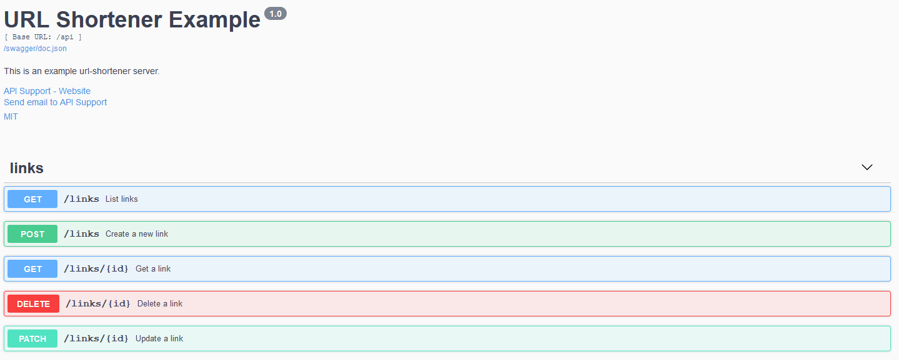

# Url Shortener Demo

This is a demo how to build a simple URL shortener with go.

## Prerequisites

To build this application you'll need Go (version 1.15 or newer). If you don't have it, visit its [official web](https://golang.org/dl/) for the installation instructions.

To run this application in Docker, you'll need to have Docker installed. If you don't have it yet, visit its [official web](https://docs.docker.com/get-docker/) for the installation instructions. On some systems you may still miss an additional tool - Docker Compose. To install it, visit [this page](https://docs.docker.com/compose/install/).

You can also run this application without Docker (_any operating system will work where golang is supported_). But if you want to use a database as a storage engine, you'll need to install either [MariaDB](https://mariadb.com/kb/en/getting-installing-and-upgrading-mariadb/) or [MySQL](https://dev.mysql.com/doc/mysql-installation-excerpt/5.7/en/) (the second option is untested however).

## Compiling

> This step is only required if you want to run the app without Docker.

The compilation is as simple as

```bash
git clone github.com/denisvmedia/urlshortener
cd urlshortener # from now on all further commands will be relative to this folder
go build .
```

As a result you'll get a binary named `urlshotener`  (on Windows you'll get `urlshotener.exe`).

## Running tests

> This step is only required if you want to make sure that the application has no defects according to the tests.

You can simply run:

### go test
```bash
go test -v -race ./...
```

### ginkgo

But if you want to have a better output and more functionality, you can install it this way:

```bash
go get github.com/onsi/ginkgo/ginkgo
```

The binary will be in `$GOPATH/bin` directory, which you may want to add to your path this way: 
```bash
PATH=$PATH:$GOPATH/bin
```

After that you can run `ginkgo` instead of `go test`:

```bash
ginkgo -race -progress ./...
```

### Running functional tests using MySQL/MariaDB

In the previous cases we used a built-in in-memory engine. It's fast and simple, but when it only exists during runtime. Whenever you stop your application you essentially lose your data. So, for tests it's good, but not for production. So, one might want to do the functional testing using the real database engine. And yes, it's possible. To run the tests the app will require a running db instance and a user in it that has permissions to create and delete database with the name, you will provide.

This is how we do this:

```bash
#!/bin/sh
TEST_STORAGE=mysql \
MYSQL_HOST=127.0.0.1:3306 \
MYSQL_DBNAME=urlshortener_test \
MYSQL_USER=urlshortener \
MYSQL_PASSWORD=password \
ginkgo -race -progress ./...
```

__WARNING__: the app will DROP any existing database with the given name (`MYSQL_DBNAME=urlshortener_test`)!

## Running the Url Shortener

### With Docker

I assume that you already have Docker and Docker Compose installed. So, just run the following scripts:

```bash
# init MariaDB and create the database and the tables
bash init.sh
# if everything went smoothly, run the next script
bash run.sh
```

In the end, you'll have a running application that exposes tcp port 31456 on your localhost. Check the following sections on how to use it.

_Hint_: to withdraw the whole application stack just run the following script:

```bash
# it calls `docker-compose down` and `docker volume rm urlshortener_mariadbdata`
bash destroy.sh
```

### Without Docker

Without using Docker you have two options how to run the app: you can either use an in-memory storage (that only exists during the program execution) or a real database - MySQL or MariaDB. It's up to you which option to choose.

#### Using In-Memory Storage

Considering that you already compiled your binary you can just run it now:

```bash
./urlshortener run
```

It will make the application accessible on the port 31456. Note, that as soon as you stop the process, all the data will be lost.

#### Using MySQL Storage

Considering that you already compiled your binary you can just run it now:

```bash
# you may omit the very last option if you want to create the database manually
echo "Create the database and the tables"
MYSQL_HOST=127.0.0.1:3306 \
MYSQL_DBNAME=urlshortener_test \
MYSQL_USER=urlshortener \
MYSQL_PASSWORD=password \
./urlshortener init-storage --storage=mysql --create-database

echo "Run the app"
MYSQL_HOST=127.0.0.1:3306 \
MYSQL_DBNAME=urlshortener_test \
MYSQL_USER=urlshortener \
MYSQL_PASSWORD=password \
./urlshortener run --storage=mysql
```

If you did everything properly, after running the application you will see the following line in the console output:

```
Storing all data in MySQL.
```

If you see this line, you are now storing your data in your DB and it will survive after application restart.

## Application Usage

After running the app, you can now access it using your browser. Let's navigate directly to the API documentation: http://localhost:31456/swagger/index.html (assuming that you used the defaults in this document). It will look like this:


Yes, it's [Swagger](https://swagger.io/)! To bring this documentation on your table, Url Shortener uses [Swag](https://github.com/swaggo/swag) - a simple to use but extremely powerful tool that converts declarative comments from go source files to swagger files. And not just that, it also allows us to embed Swagger UI server into the application, and that's how the app exposes its API.

> _Sidenote_. If you want to rebuild the Swagger docs, you'll need to install `swag` (check their repository for the docs) and then run:
> 
> ```bash
> swag init
> ```

### CRUD API

The app exposes 5 API endpoints:

- GET `/api/links`
- GET `/api/links/:id`
- POST `/api/links`
- PATCH `/api/links/:id`
- DELETE `/api/links/:id`

All API endpoints use [JSON API](https://jsonapi.org/) as an API specification standard. BTW, this is why `id`'s are strings for all entities in this project. It's done according to the chosen specification. And it actually makes sense, because in many cases you either don't want to have auto-incrementing ints or even can't have them, so the standard gives you freedom of choice.

Check Swagger docs on the details. _There is just one thing missing at the moment: the error responses are not documented. But you can check the functional tests or just experiment with the API yourself._

### ShortName Redirects

Finally, when you are done and you have some short urls created, just pick the name you created (or if you left it empty, then the app would have created it for you) and go to the website root and append your short name to it: http://localhost:31456/my-cool-short-url , where `my-cool-short-url` is your link short name. If you did everything properly (and also you didn't face a bug on your road) then this short link should redirect you to the long url you specified when you added the link to the app.

### Prometheus Metrics Endpoint

In addition this application exposes a `/metrics` endpoint in Prometheus format. By default the official client library exposes golang and own metrics. In addition this app exposes the following:

```
# HELP urlshortener_requests_processed_total Number of total redirect requests processed by response code.
# TYPE urlshortener_requests_processed_total counter
urlshortener_requests_processed_total{code="301"} 10
urlshortener_requests_processed_total{code="404"} 3
```
Whenever a visitor opens an existing short link, the counter increments the "301" code label. Any missing link will go to the "404" line.

## Final Thoughts, TODOs, etc.


This app lacks some functionality.

- Authentication and any kind of permissions.
  - In terms of microservice architecture one could want to utilize JWT and as such do not complicate this app drastically).
  - if you have a simple envirnoment, you may want to put this application behind nginx and protect the API endpoint with just HTTP Basic Authentication.
- UI is missing.
  - This app is just a demo of API, so UI is not a part of this project. But it's easy to add it. My favorite would be [Vue.js](https://vuejs.org/).
- Documentation is brief and lacks some parts.
- Not all parts of the code are covered by tests.
- Linter could be used to find code issues
- Static analysys could be used as well

## Credits

Components and standards that are the core and the heart of this app:

- [JSON API](https://jsonapi.org/) Specification
- [Swagger](https://swagger.io/)
- [Swag](https://github.com/swaggo/swag) - Swagger documentation generator go your go code
- [api2go](https://github.com/manyminds/api2go) - JSON API (_this app uses [my fork](https://github.com/go-extras/api2go), which is slightly more flexible and adds a couple of features_).

Of course, other tools that this app utilizes are great too:

- [Docker](https://docker.io/)
- [Prometheus](https://prometheus.io/)

And many more... Just check `go.mod` file for the direct dependencies used.

## License and Copyright

This application is licensed under MIT license and you are free to use it in whatever way you want. 

(c) 2020 Denis Voytyuk
